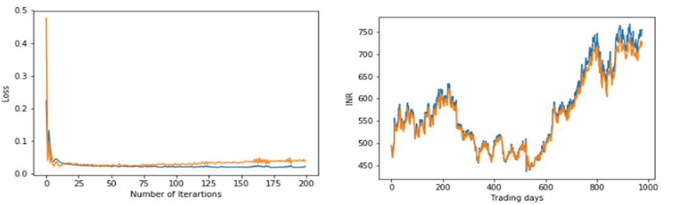
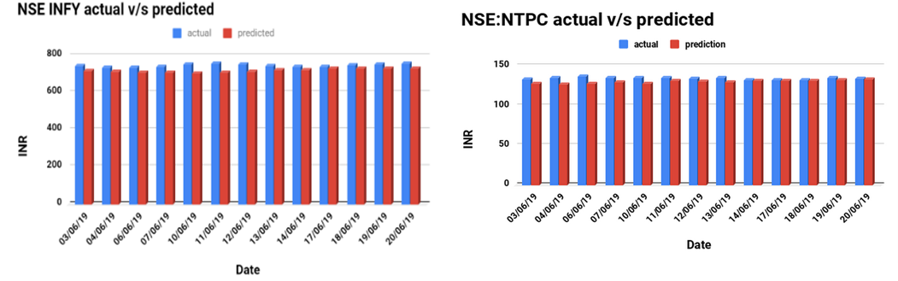
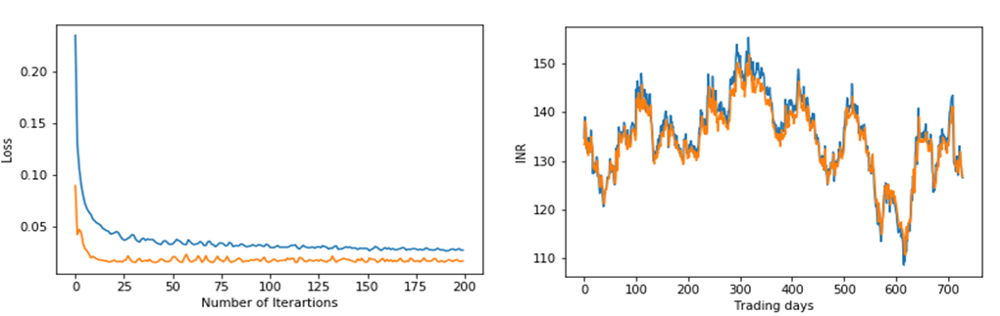
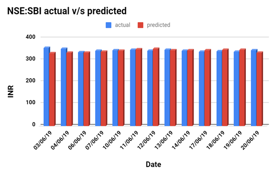
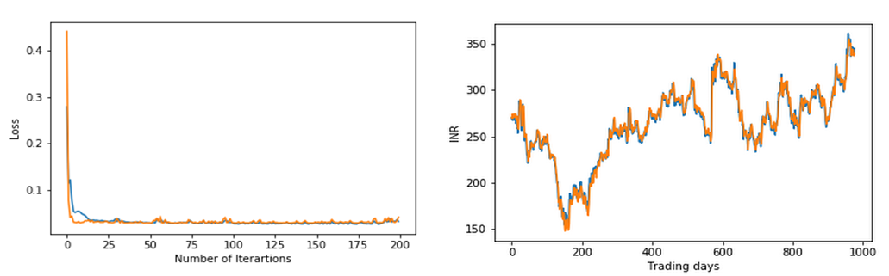
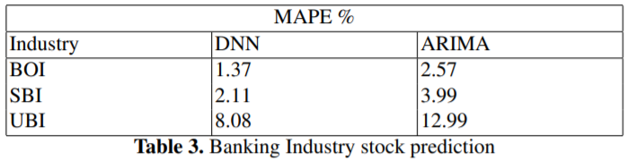
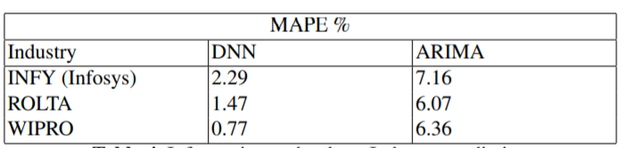
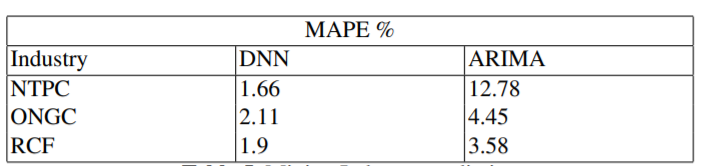

# Stock-predictor-Deep-learning
Stock prediction using Deep learning <br/>

Stock market forecasting plays a vital role in the
decision making of financial firms and investors. This paper
focuses and details a comparative study for stock price prediction
of Indian industries with stock data from NSE (National Stock
Exchange). A lot of research is concentrated for stock forecasting
from last decades which got significance with emergence of deep
learning. The deep learning techniques focused are <b>LSTM (Long
Short Term Memory), GRU (Grated Recurrent Unit) and RNN
(Recurrent Neural Network)</b>. Stock data of automobile and
financial industries are taken for analysis. This paper compares
the results with <b>ARIMA model</b>, a statistical model for stock
prediction as baseline. <b>MAPE (Mean Average Percentage Error)</b>
is used as performance criterion. This work reveals how the
investors can make use of deep learning techniques to revise their
investment decisions and strategies to hone better returns over
time. It helps the financial analysts and business communities to
make informed decisions.
<br/>

<br/>

<br/>

<br/>

<br/>


<br/>

<br/>

<br/>


# Running code
```
python getdataset.py eg: NSE:SBIN  <br/>
```
```
python mainfile.py
```
